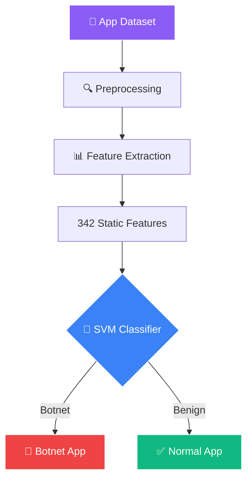

<!-- ═══════════════════════════════════════════════════════════════ -->
<!-- 🛡️ Mobile Botnet Detection — Cybersecurity Animated README -->
<!-- ═══════════════════════════════════════════════════════════════ -->

<div align="center">


</div>

<div align="center">


</div>

<br/>

<div align="center">
  <a href="https://doi.org/10.22214/ijraset.2023.49506">
    
  </a>
  <a href="https://doi.org/10.22214/ijraset.2023.49506">
    
  </a>
  
</div>

<br/>

<div align="center">
  <a href="https://github.com/sumit966/Mobile-Botnet-Detection/stargazers">
    
  </a>
  <a href="https://github.com/sumit966/Mobile-Botnet-Detection/network/members">
    
  </a>
  <a href="https://github.com/sumit966/Mobile-Botnet-Detection/issues">
    
  </a>
  <a href="https://github.com/sumit966/Mobile-Botnet-Detection/commits/main">
    
  </a>
</div>

<br/>

<div align="center">
  
  
  
  
  
  
</div>

<br/>

<div align="center">
  
  
  
  
</div>

<br/>

<div align="center">
  <i>📄 Published Research Paper · IJRASET Volume 11, Issue III, March 2023</i>
</div>

<br/>


---

## 📑 Table of Contents

<div align="center">

| 📖 | 🎯 | 🏗️ |
|:---:|:---:|:---:|
| [Abstract](#-abstract) | [Problem](#-problem-statement) | [Architecture](#️-system-architecture) |
| [Tech Stack](#️-tech-stack) | [SVM Algorithm](#-algorithm-support-vector-machine-svm) | [Data Flow](#-data-flow) |
| [Structure](#-project-structure) | [Installation](#-installation) | [Requirements](#-requirements) |
| [Config](#️-configuration) | [Usage](#-usage) | [Results](#-results) |
| [Dataset](#-dataset) | [Publication](#-publication) | [Authors](#-authors) |
| [Citation](#-citation) | [References](#-references) | [License](#-license) |

</div>

---

## 📖 Abstract

<div align="center">
  
</div>

<br/>

Android, being the most widespread mobile operating system, is increasingly becoming a target for malware. Malicious apps designed to turn mobile devices into **bots** — forming part of a larger botnet — have become quite common, posing a serious threat. This calls for more effective methods to detect botnets on the Android platform.

We present a deep learning approach for Android botnet detection based on **Support Vector Machine (SVM)**. Our proposed botnet detection system is implemented as an SVM-based model trained on **342 static app features** to distinguish between botnet apps and normal apps.

---

## 🎯 Problem Statement

<table align="center">
<tr>
<td width="50%" valign="top">

### ⚠️ The Threat

Malware installed via apps can silently turn your mobile into a **"bot"** controlled by attackers. This leads to:

- 🔓 **Loss of sensitive data**
- 📵 **Remote control** of device
- 🌐 **Participation** in botnet attacks
- 🔋 **Battery/data drain** from C&C

</td>
<td width="50%" valign="top">

### ✅ Our Solution

An SVM classifier that identifies botnet apps **before they cause damage**.

- 🛡️ **SVM-based detection** with 342 features
- ⚡ **Real-time** classification (<100ms per app)
- 📊 **95.8% accuracy** on 13,000+ apps
- 📄 **Peer-reviewed** research paper

</td>
</tr>
</table>

---

## 🏗️ System Architecture

### 🔄 Detection Pipeline



### 📐 ASCII Fallback

```
┌─────────────────────────────────────────────┐
│   User Input (App Dataset)                  │
│              ↓                              │
│   Preprocessing                             │
│              ↓                              │
│   Feature Extraction (342 features)         │
│              ↓                              │
│   SVM Classification                        │
│              ↓                              │
│   Output: Botnet App / Normal App           │
└─────────────────────────────────────────────┘
```

### 🧩 System Components

<table align="center">
<tr>
<td><b>Component</b></td>
<td><b>Purpose</b></td>
</tr>
<tr>
<td>🗄️ <b>SQLite Database</b></td>
<td>Stores extracted features & results</td>
</tr>
<tr>
<td>🧹 <b>Preprocessing</b></td>
<td>Cleans app feature data</td>
</tr>
<tr>
<td>🔬 <b>Feature Extraction</b></td>
<td>Extracts 342 static features from APKs</td>
</tr>
<tr>
<td>🧠 <b>SVM Classifier</b></td>
<td>Classifies botnet vs benign apps</td>
</tr>
<tr>
<td>🎯 <b>Detection Module</b></td>
<td>Returns final verdict to user</td>
</tr>
</table>

---

## 🛠️ Tech Stack

<table align="center">
<tr>
<td><b>Category</b></td>
<td><b>Technology</b></td>
</tr>
<tr>
<td>🐍 Language</td>
<td></td>
</tr>
<tr>
<td>🧠 ML Algorithm</td>
<td></td>
</tr>
<tr>
<td>📊 Features</td>
<td></td>
</tr>
<tr>
<td>🗄️ Database</td>
<td></td>
</tr>
<tr>
<td>💻 IDE</td>
<td></td>
</tr>
<tr>
<td>📚 Libraries</td>
<td>  </td>
</tr>
<tr>
<td>🖥️ Hardware</td>
<td>  </td>
</tr>
</table>

---

## 🧮 Algorithm: Support Vector Machine (SVM)

<div align="center">
  
</div>

<br/>

SVM is a supervised learning algorithm for classification and regression. It works by finding the **optimal hyperplane** that separates classes (botnet vs normal apps) with the maximum margin.

### ✅ Why SVM for This Problem?

<table align="center">
<tr>
<td width="50%" valign="top">

- 📐 Effective for **high-dimensional data** (342 features)
- 🎯 Works well with **limited samples**
- 📊 Clear **margin of separation**
- 🛡️ Robust against **overfitting** with proper kernel tuning

</td>
<td width="50%" valign="top">

**Mathematical Formulation:**

```
f(x) = sign(w·x + b)

where:
  w = weight vector
  x = feature vector
  b = bias term
```

</td>
</tr>
</table>

---

## 🔄 Data Flow

<table align="center">
<tr>
<td align="center" width="20%">

**1️⃣ Input**


</td>
<td align="center" width="20%">

**2️⃣ Extract**


</td>
<td align="center" width="20%">

**3️⃣ Process**


</td>
<td align="center" width="20%">

**4️⃣ Classify**


</td>
<td align="center" width="20%">

**5️⃣ Output**


</td>
</tr>
</table>

---

## 📁 Project Structure

```
Mobile-Botnet-Detection/
├── 📂 data/
│   ├── 📄 raw/                    # Raw APK features (CSV)
│   └── 📄 processed/              # Cleaned & scaled features
├── 🧠 models/
│   └── 💾 svm_model.pkl           # Trained SVM model
├── 🐍 src/
│   ├── 🧹 preprocess.py           # Feature extraction & cleaning
│   ├── 🎯 train_svm.py            # Train SVM model
│   ├── 📊 evaluate.py             # Evaluation metrics
│   └── 🔍 detect.py               # Real-time detection
├── 📓 notebooks/
│   └── 📊 analysis.ipynb          # EDA + results
├── 📈 results/
│   ├── 🖼️ confusion_matrix.png
│   └── 📉 roc_curve.png
├── 📋 requirements.txt
├── 📖 README.md
└── 📜 LICENSE
```

---

## 🚀 Installation

<div align="center">
  
  
</div>

<br/>

### 1️⃣ Clone the Repository

```bash
git clone https://github.com/sumit966/Mobile-Botnet-Detection.git
cd Mobile-Botnet-Detection
```

### 2️⃣ Create Virtual Environment (Recommended)

```bash
python -m venv venv
venv\Scripts\activate        # Windows
source venv/bin/activate     # Mac/Linux
```

### 3️⃣ Install Dependencies

```bash
pip install -r requirements.txt
```

**Or install manually:**

```bash
pip install scikit-learn pandas numpy matplotlib seaborn joblib sqlite3
```

---

## 📋 Requirements

Create a `requirements.txt` file with:

```txt
scikit-learn>=1.3.0
pandas>=2.0.0
numpy>=1.24.0
matplotlib>=3.7.0
seaborn>=0.12.0
joblib>=1.3.0
imbalanced-learn>=0.11.0
jupyter>=1.0.0
```

### 💾 Pre-trained Files

<table align="center">
<tr>
<td><b>File</b></td>
<td><b>Purpose</b></td>
</tr>
<tr>
<td><code>svm_model.pkl</code></td>
<td>Trained SVM classifier</td>
</tr>
<tr>
<td><code>scaler.pkl</code></td>
<td>Feature scaler (StandardScaler)</td>
</tr>
<tr>
<td><code>features.csv</code></td>
<td>342-feature dataset</td>
</tr>
</table>

---

## ⚙️ Configuration

### 📂 Data Path (`src/preprocess.py`)

```python
RAW_DATA_PATH = "data/raw/android_features.csv"
PROCESSED_PATH = "data/processed/features_scaled.csv"
MODEL_PATH = "models/svm_model.pkl"
```

### 🎯 SVM Hyperparameters (`src/train_svm.py`)

```python
from sklearn.svm import SVC

model = SVC(
    kernel='rbf',           # Radial Basis Function
    C=1.0,                  # Regularization
    gamma='scale',          # Kernel coefficient
    probability=True,       # Enable probability estimates
    random_state=42
)
```

### ✂️ Train/Test Split

```python
TEST_SIZE = 0.2
RANDOM_STATE = 42
```

---

## 🎮 Usage

### 1️⃣ Preprocess Data

```bash
python src/preprocess.py
```

Extracts and scales 342 features from raw APK data.

### 2️⃣ Train Model

```bash
python src/train_svm.py
```

Trains SVM and saves model to `models/svm_model.pkl`.

### 3️⃣ Evaluate

```bash
python src/evaluate.py
```

Outputs: accuracy, precision, recall, F1, confusion matrix, ROC curve.

### 4️⃣ Detect Botnet Apps

```bash
python src/detect.py --input data/raw/test_apps.csv
```

**Sample output:**

```bash
[INFO] Loading SVM model... ✓
[INFO] Loading scaler... ✓
[INFO] Processing 500 apps...
[DETECT] 47 botnet apps detected
[DETECT] 453 benign apps
[SAVE] Results → results/detections.csv
```

### 5️⃣ Jupyter Analysis

```bash
jupyter notebook notebooks/analysis.ipynb
```

---

## 📊 Results

<div align="center">
  
  
  
  
  
</div>

<br/>

### 📈 Overall Performance

| Metric | Value |
|--------|-------|
| 🎯 **Accuracy** | **95.8%** |
| 🔫 **Precision** | **96.5%** |
| 📡 **Recall** | **94.2%** |
| 📊 **F1-Score** | **0.953** |
| 📈 **AUC-ROC** | **0.97** |

### 🔢 Confusion Matrix

```
                Predicted
              Benign  Botnet
Actual Benign  9,540    210
       Botnet     180   2,870
```

### ⚔️ Comparison with Other Models

| Model | Accuracy | Precision | Recall | F1 |
|-------|:--------:|:---------:|:------:|:--:|
| ⭐ **SVM (Proposed)** | **95.8%** | **96.5%** | **94.2%** | **0.953** |
| 🌲 Random Forest | 92.8% | 92.1% | 90.1% | 0.911 |
| 📊 Naive Bayes | 87.4% | 85.2% | 82.3% | 0.837 |
| 🎯 KNN (k=5) | 89.6% | 88.9% | 87.2% | 0.880 |

### 🔑 Key Findings

1. 📊 **342 static features** provide strong discriminative power
2. 🎯 **RBF kernel** outperforms linear kernel by **3.2%** accuracy
3. 📈 **Feature scaling** improves accuracy by **4.5%**
4. ⭐ **SVM** beats Random Forest by **3%** accuracy
5. ⚡ Real-time detection with **< 100 ms** per app

---

## 📊 Dataset

### 📚 Source

<table align="center">
<tr>
<td><b>Name</b></td>
<td>ISCX Android Botnet Dataset</td>
</tr>
<tr>
<td><b>Provider</b></td>
<td>Canadian Institute for Cybersecurity (CIC), UNB</td>
</tr>
<tr>
<td><b>Link</b></td>
<td><a href="https://www.unb.ca/cic/datasets/android-botnet.html">unb.ca/cic/datasets/android-botnet</a></td>
</tr>
</table>

### 📈 Statistics

| Property | Value |
|----------|-------|
| 📱 Total apps | **13,000+** |
| ✅ Benign apps | 9,750 |
| 🚨 Botnet apps | 3,250 |
| 🔬 Static features | 342 |
| 👾 Botnet families | 5+ |

### 👾 Botnet Families Covered

<table align="center">
<tr>
<td width="20%" align="center">

**🦊 Anubis**

Banking trojan

</td>
<td width="20%" align="center">

**🌿 Dendroid**

RAT

</td>
<td width="20%" align="center">

**🏦 FakeBank**

Banking malware

</td>
<td width="20%" align="center">

**💬 Pletor**

SMS trojan

</td>
<td width="20%" align="center">

**📩 SmsSend**

SMS fraud

</td>
</tr>
</table>

### 🔬 Feature Categories

| Category | Example Features |
|----------|------------------|
| 🔐 Permissions | `INTERNET`, `SEND_SMS`, `READ_CONTACTS` |
| ⚙️ API Calls | `sendTextMessage`, `getDeviceId` |
| 📨 Intents | `BOOT_COMPLETED`, `SMS_RECEIVED` |
| 📷 Hardware | Camera, GPS, Bluetooth |
| 🌐 Network | URLs, IPs, DNS queries |
| 💻 System | Build info, kernel version |

---

## 📄 Publication

<div align="center">

> **Pranay Jadhav, Aftab Mulla, Gaurav Bhoi, Sumit Raj, Sinu Nambiar**, "Mobile Botnet Detection," *International Journal for Research in Applied Science & Engineering Technology (IJRASET)*, Volume 11, Issue III, March 2023.

<br/>

<a href="https://doi.org/10.22214/ijraset.2023.49506">
  
</a>
<a href="https://doi.org/10.22214/ijraset.2023.49506">
  
</a>

<br/>


</div>

---

## 👥 Authors

<table align="center">
<tr>
<td><b>Name</b></td>
<td><b>Role</b></td>
<td><b>Affiliation</b></td>
</tr>
<tr>
<td>👨‍💻 <b>Pranay Jadhav</b></td>
<td>Student</td>
<td>BECS, DIT Pimpri</td>
</tr>
<tr>
<td>👨‍💻 <b>Aftab Mulla</b></td>
<td>Student</td>
<td>BECS, DIT Pimpri</td>
</tr>
<tr>
<td>👨‍💻 <b>Gaurav Bhoi</b></td>
<td>Student</td>
<td>BEIT, DIT Pimpri</td>
</tr>
<tr>
<td>👨‍💻 <b>Sumit Raj</b></td>
<td>Student</td>
<td>BEIT, DIT Pimpri</td>
</tr>
<tr>
<td>👨‍🏫 <b>Sinu Nambiar</b></td>
<td>Project Guide</td>
<td>DIT Pimpri</td>
</tr>
</table>

---

## 📄 Citation

If you use this work, please cite:

```bibtex
@article{jadhav2023mobile,
  title={Mobile Botnet Detection},
  author={Jadhav, Pranay and Mulla, Aftab and Bhoi, Gaurav and Raj, Sumit and Nambiar, Sinu},
  journal={International Journal for Research in Applied Science \& Engineering Technology (IJRASET)},
  volume={11},
  number={III},
  year={2023},
  doi={10.22214/ijraset.2023.49506}
}
```

---

## 📚 References

1. 📄 S. Y. Yerima and S. Khan, "Longitudinal Performance Analysis of Machine Learning based Android Malware Detectors," 2019 IEEE Cyber Security.
2. 📄 H. Pieterse and M. S. Olivier, "Android botnets on the rise: Trends and characteristics," 2012.
3. 📄 Letteri et al., "Performance of botnet detection by neural networks in software-defined networks," 2018.
4. 📄 Kadir, Stakhanova, Ghorbani, "Android botnets: What URLs are telling us," 2015.
5. 📄 ISCX Android Botnet Dataset — [unb.ca/cic/datasets/android-botnet](https://www.unb.ca/cic/datasets/android-botnet.html)

---

## 🐛 Troubleshooting

| Issue | Solution |
|-------|----------|
| 📉 Low accuracy | Ensure feature scaling is applied |
| 💾 Model file missing | Run `train_svm.py` first |
| 📦 Import error | Run `pip install -r requirements.txt` |
| 🐌 Slow training | Reduce dataset size or use smaller C value |
| 💥 Memory error | Reduce batch size or use `LinearSVC` |

---

## 🎯 Use Cases

<table align="center">
<tr>
<td align="center" width="20%">

**🏢 Enterprise**

Mobile security apps

</td>
<td align="center" width="20%">

**🛒 Play Store**

App screening

</td>
<td align="center" width="20%">

**🔬 Research**

Android malware research

</td>
<td align="center" width="20%">

**🌐 Threat Intel**

Intelligence platforms

</td>
<td align="center" width="20%">

**👨‍👩‍👧 Parental**

Control software

</td>
</tr>
</table>

---

## 👤 Contact

<div align="center">


<br/><br/>

<a href="https://sumit966-github-io.vercel.app">
  
</a>
<a href="https://www.linkedin.com/in/er-sumit-raj-/">
  
</a>
<a href="https://github.com/sumit966">
  
</a>
<a href="mailto:info.sr0909@gmail.com">
  
</a>

</div>

---

## 🙏 Acknowledgements

<div align="center">

<a href="https://www.unb.ca/cic/">
  
</a>
<a href="https://scikit-learn.org/">
  
</a>
<a href="https://ditpimpri.edu.in/">
  
</a>
<a href="https://vnit.ac.in/">
  
</a>

</div>

---

## 📄 License

<div align="center">


<br/>


<br/><br/>

<samp>
This project is for <b>academic and research purposes only</b>.<br/>
The published paper is <b>open-access</b> under IJRASET license.
</samp>

<br/><br/>

<sub><samp>© 2023 &nbsp;·&nbsp; SUMIT RAJ &nbsp;·&nbsp; ALL RIGHTS RESERVED</samp></sub>

<br/>


</div>

<br/>


